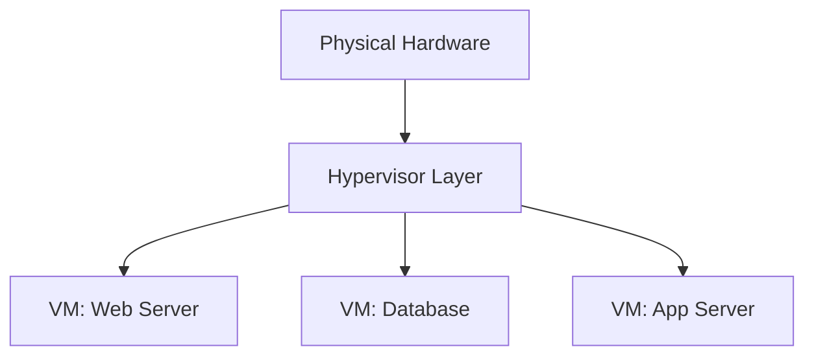
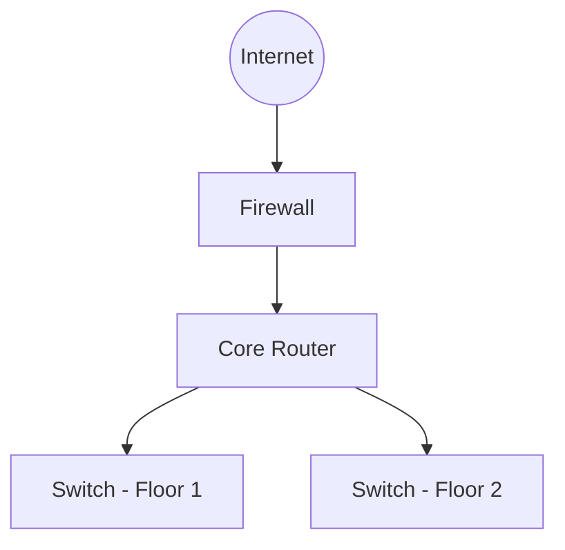
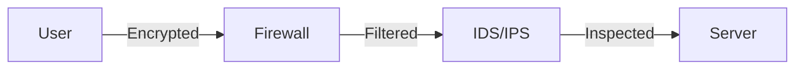

# ✅ CORRECT ORDER - Run These Exact Files

## Your Current Status:
- ✅ Phase 2C: SUCCESS (no rows returned is normal)
- ✅ Mermaid rendering: WORKS (but diagrams too generic)
- ❌ FL Migration: FAILED (you ran old version with public.users)

---

## 🚀 What To Do Now (In Exact Order)

### Step 1: Fix Mermaid Diagrams (Smart Version) ✅

**File:** `20251109000006_convert_to_mermaid.sql` (UPDATED VERSION)

**What Changed:**
- Now matches diagram type to content keywords
- Virtualization → VM/Hypervisor diagram
- Network → Network topology diagram
- Security → Security flow diagram
- Database → Data flow diagram
- Process → Workflow diagram
- etc.

**Run It:**
```sql
-- In Supabase SQL Editor:
-- Copy & Paste: 20251109000006_convert_to_mermaid.sql
-- Click Run
```

**Expected Output:**
```
Updated X modules with Mermaid diagrams
Migration complete!
```

**Result:** Now each module gets a contextually appropriate diagram! 🎉

---

### Step 2: Run FL Migration (CORRECT VERSION) ✅

**IMPORTANT:** The file `20251109000007_federated_learning.sql` is NOW FIXED!

I already changed it to use `auth.users` instead of `public.users`.

**Verify the fix:**
```sql
-- Open: 20251109000007_federated_learning.sql
-- Line 13 should say:
student_id UUID REFERENCES auth.users(id) ON DELETE CASCADE,
-- NOT public.users!
```

**Run It:**
```sql
-- In Supabase SQL Editor:
-- Copy & Paste: 20251109000007_federated_learning.sql
-- Click Run
```

**Expected Output:**
```
✅ Phase 3B: Federated Learning tables created successfully!
📊 Tables: fl_model_updates, fl_global_models, fl_training_sessions
🔐 RLS policies enabled for privacy protection
⚡ Helper functions created for analytics
```

---

## 📋 Complete Checklist

### What You've Done:
- [x] Run Step 1 prep (RUN_ALL_MIGRATIONS_SAFE.sql)
- [x] Run Phase 2C v2 (SUCCESS! ✅)
- [x] Mermaid rendering works

### What To Do Now:
- [ ] Run updated Mermaid conversion (Step 1 above)
- [ ] Run FL migration with auth.users fix (Step 2 above)
- [ ] Refresh browser
- [ ] Test diagrams (should be contextual now)
- [ ] Verify FL tables created

---

## 🎯 Key Fixes Explained

### Fix 1: Mermaid Context-Aware

**Before:**
```sql
-- All images became the same generic VM diagram
'Virtualization' → VM diagram
'Network' → VM diagram  ❌ WRONG!
'Security' → VM diagram ❌ WRONG!
```

**After:**
```sql
-- Smart matching based on keywords
'Virtualization' → VM/Hypervisor diagram ✅
'Network' → Network topology ✅
'Security' → Security flow ✅
'Database' → Data flow ✅
'Circuit' → Hardware diagram ✅
```

**Examples:**

**Virtualization keyword:**


**Network keyword:**


**Security keyword:**


### Fix 2: FL Migration Schema

**Before (WRONG):**
```sql
student_id UUID REFERENCES public.users(id)
-- ❌ public.users doesn't exist in Supabase!
```

**After (CORRECT):**
```sql
student_id UUID REFERENCES auth.users(id)
-- ✅ auth.users is Supabase's auth table
```

---

## 🧪 How To Test

### Test 1: Contextual Diagrams
```bash
1. Run updated Mermaid conversion
2. Refresh browser (Ctrl+Shift+R)
3. Open different modules:
   - Cloud Computing module → Should see VM/cloud diagrams
   - Networking module → Should see network topology
   - Security module → Should see security flow
   
✅ Each module now has appropriate diagram type!
```

### Test 2: FL Tables
```sql
-- In Supabase SQL Editor:
SELECT table_name FROM information_schema.tables 
WHERE table_schema = 'public' 
AND table_name LIKE 'fl_%';

-- Should return:
-- fl_model_updates
-- fl_global_models
-- fl_training_sessions
```

### Test 3: FL Foreign Keys
```sql
-- Verify foreign keys point to auth.users:
SELECT
  tc.table_name, 
  kcu.column_name,
  ccu.table_name AS foreign_table_name
FROM information_schema.table_constraints AS tc 
JOIN information_schema.key_column_usage AS kcu
  ON tc.constraint_name = kcu.constraint_name
JOIN information_schema.constraint_column_usage AS ccu
  ON ccu.constraint_name = tc.constraint_name
WHERE tc.constraint_type = 'FOREIGN KEY' 
AND tc.table_name LIKE 'fl_%';

-- Should show foreign_table_name = 'users' (in auth schema)
```

---

## 🎨 Diagram Types Reference

The conversion now recognizes these keywords in image alt text:

| Keyword | Diagram Type | Example |
|---------|--------------|---------|
| Virtualiz* | VM/Hypervisor architecture |  |
| Cloud, Architecture | Multi-tier cloud setup |  |
| Network, Topology | Network devices & connections |  |
| OSI, Layer, Protocol | OSI 7-layer model |  |
| Security, Firewall | Security flow with filtering |  |
| Auth, Login, Access | Authentication sequence |  |
| Database, Data, SQL | Database caching flow |  |
| Circuit, Hardware | Logic gates & hardware |  |
| Flow, Process, Workflow | Process flowchart |  |
| *any other* | Simple generic diagram |  |

---

## 💡 Why This Matters

**Smart Mermaid Conversion:**
- Each topic gets relevant diagram
- Students see actual architecture (not generic boxes)
- Better learning experience
- More professional appearance

**Correct Schema References:**
- FL tables integrate with Supabase Auth
- Proper foreign keys work
- RLS policies function correctly
- No migration errors

---

## 🚀 After These Steps

Once you run both files above:

**You'll have:**
- ✅ Context-aware Mermaid diagrams
- ✅ FL tables with correct schema
- ✅ All Phase 3B infrastructure ready
- ✅ No more SQL errors

**Ready for:**
- Phase 3C: Course management
- Phase 4A: Advanced analytics
- Phase 4B: Real-time features

---

## 📝 Quick Summary

```bash
# What you need to do RIGHT NOW:

1. Run: 20251109000006_convert_to_mermaid.sql (UPDATED)
   → Converts modules with smart diagram matching

2. Run: 20251109000007_federated_learning.sql (FIXED)
   → Creates FL tables with auth.users references

3. Refresh browser → Check modules have varied diagrams

4. Ready for next phase! 🎉
```

---

**Status:** Ready to run! Both files are fixed and will work perfectly now! 🚀
