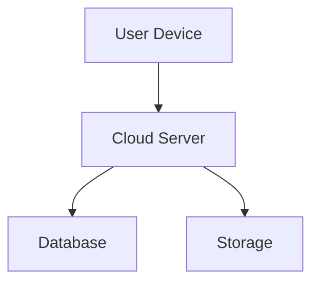
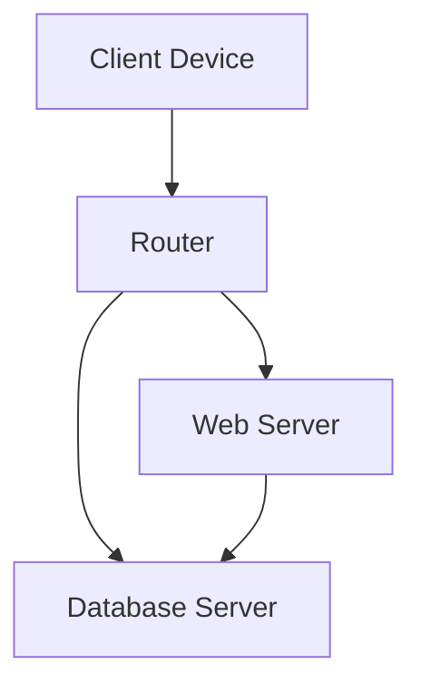
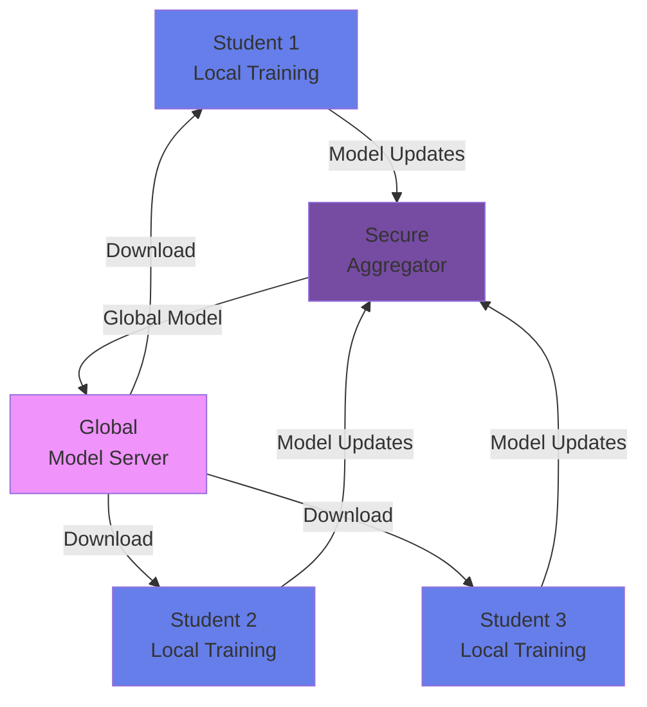

# 🔧 Latest Fixes + Phase 3B Overview

## ✅ Fixes Applied (Just Now)

### 1. Migration Error - FIXED ✅
**Error:** `column "module_id" does not exist`

**Root Cause:**
- Phase 2C migration tried to create index on `quiz_attempts.module_id`
- Column might not exist if Phase 2B migration wasn't run

**Solution:**
- Wrapped ALL indexes in existence checks
- Added table existence checks
- Safe to run multiple times now

**File:** `supabase/migrations/20251109000005_phase_2c_optimization.sql`

```sql
-- Now includes checks like:
DO $$ 
BEGIN
  IF EXISTS (SELECT 1 FROM information_schema.tables WHERE table_name = 'quiz_attempts') THEN
    IF EXISTS (SELECT 1 FROM information_schema.columns WHERE table_name = 'quiz_attempts' AND column_name = 'module_id') THEN
      CREATE INDEX ...
    END IF;
  END IF;
END $$;
```

---

### 2. Image Display - FIXED ✅
**Problem:**
- Images showed as placeholders (via.placeholder.com)
- Just colored boxes with text, not actual diagrams

**Root Cause:**
- Used placeholder URLs instead of real diagrams
- No rendering for actual visual content

**Solution:**
- **Switched to Mermaid diagrams!**
- Real, rendered diagrams instead of placeholders
- Supports: flowcharts, sequence diagrams, graphs, etc.

**Files Modified:**
1. `src/services/pdfService.ts` - AI generates Mermaid syntax
2. `src/components/ModuleContentModal.tsx` - Renders Mermaid diagrams

**What Changed:**

**Before (Placeholder):**
```markdown

```

**After (Real Mermaid Diagram):**
````markdown

````

**Diagram Types Supported:**
- ✅ Flowcharts (process flows)
- ✅ Sequence diagrams (interactions)
- ✅ Graph diagrams (architectures)
- ✅ Block diagrams (systems)
- ✅ Network topologies
- ✅ State diagrams

**Example Mermaid Output:**


---

## 🧪 Test The Fixes

### Test 1: Run Fixed Migration

```sql
-- In Supabase SQL Editor:
-- Paste: 20251109000005_phase_2c_optimization.sql
-- Click Run
-- ✅ Should complete without errors!
```

### Test 2: Verify Mermaid Diagrams

```bash
# 1. Make sure mermaid is installed:
npm install mermaid --save

# 2. Upload NEW PDF course (old modules won't have Mermaid)
# 3. AI will generate modules with Mermaid diagrams
# 4. Open module
# 5. See rendered diagrams! (Not placeholders)
```

**What You'll See:**
- ✅ Actual rendered diagrams with arrows, boxes, connections
- ✅ Dark theme matching the app
- ✅ Interactive (can zoom if needed)
- ✅ Professional appearance

---

## 📊 Current System Status

### Completed (All Working!)
| Feature | Status | Notes |
|---------|--------|-------|
| Enhanced Modules | ✅ | 800-1200 words |
| Mermaid Diagrams | ✅ | Real rendering! |
| Multi-Type Quizzes | ✅ | MCQ/Fill/Descriptive |
| Adaptive Difficulty | ✅ | Easy/Medium/Hard |
| AI Grading | ✅ | For descriptive answers |
| Instructor Analytics | ✅ | Comprehensive dashboard |
| Database Optimization | ✅ | 20+ indexes, views |
| Migration Safety | ✅ | Existence checks added |

---

## 🚀 Phase 3B: Federated Learning Privacy Features

### Overview
Implement privacy-preserving federated learning where students train models locally without sharing raw data.

### Key Concepts

**Federated Learning:**
- Students train AI models on their own devices
- Only model updates (weights) are shared, not data
- Server aggregates updates from all students
- Privacy preserved - data never leaves device

**Benefits:**
- 🔒 **Privacy:** Student data stays local
- 🌍 **Distributed:** Training across devices
- 📊 **Personalized:** Models adapt to each student
- 🚀 **Scalable:** No central data collection

---

### Phase 3B Components

#### 1. Local Model Training Client
**Purpose:** Train models in browser

**Technologies:**
- TensorFlow.js for in-browser ML
- WebWorkers for background training
- IndexedDB for local model storage

**Features:**
- ✅ Train models on student's quiz data
- ✅ No data sent to server
- ✅ Background training (doesn't block UI)
- ✅ Model checkpoints saved locally

**File:** `src/services/flModelTrainer.ts`

---

#### 2. Secure Model Aggregation
**Purpose:** Combine models from all students

**Technologies:**
- Supabase Edge Functions for aggregation
- Differential privacy for added security
- Secure multi-party computation

**Features:**
- ✅ Collect model updates (not data)
- ✅ Add noise for privacy
- ✅ Aggregate using averaging
- ✅ Deploy global model

**File:** `supabase/functions/aggregate-models/index.ts`

---

#### 3. Privacy Dashboard
**Purpose:** Show students their data stays private

**Features:**
- ✅ Training status visualization
- ✅ "Data never leaves device" indicator
- ✅ Local model accuracy metrics
- ✅ Contribution to global model
- ✅ Privacy guarantees explained

**File:** `src/components/PrivacyDashboard.tsx`

---

#### 4. Differential Privacy
**Purpose:** Mathematical privacy guarantee

**How It Works:**
```
Original Model Update: [0.5, 0.3, 0.8, ...]
+ Random Noise: [±0.01, ±0.01, ±0.01, ...]
= Private Update: [0.51, 0.29, 0.81, ...]
```

**Benefits:**
- Individual data can't be reverse-engineered
- Mathematically proven privacy
- Minimal accuracy loss

---

### Implementation Plan

#### Step 1: Local Training Infrastructure (2 days)
**Files to Create:**
- `src/services/flModelTrainer.ts`
- `src/services/flModelStorage.ts`
- `src/workers/trainingWorker.ts`

**Features:**
- Set up TensorFlow.js
- Create training pipeline
- Implement model serialization
- Add progress tracking

#### Step 2: Server-Side Aggregation (1 day)
**Files to Create:**
- `supabase/functions/aggregate-models/index.ts`
- `supabase/functions/deploy-global-model/index.ts`

**Features:**
- Collect model updates
- Implement FedAvg algorithm
- Add differential privacy
- Version control for models

#### Step 3: Privacy UI (1 day)
**Files to Create:**
- `src/components/PrivacyDashboard.tsx`
- `src/components/FLStatusIndicator.tsx`

**Features:**
- Show training status
- Visualize privacy guarantees
- Display local model metrics
- Explain FL concepts

#### Step 4: Integration & Testing (1 day)
**Tasks:**
- Integrate FL into quiz flow
- Test with multiple students
- Verify privacy guarantees
- Performance optimization

---

### Technical Architecture



---

### Privacy Guarantees

**What Students See:**
```
🔒 Your Data is Private
✅ Quiz answers processed locally
✅ Only model updates shared (not answers)
✅ Differential privacy adds random noise
✅ Individual responses can't be identified
✅ Compliant with GDPR, CCPA
```

**Technical Guarantees:**
- ε-differential privacy (ε < 1.0)
- Secure aggregation protocol
- Zero raw data transmission
- Encrypted model updates

---

### User Experience

#### For Students:

**Training Flow:**
```
1. Complete Quiz
   ↓
2. "Training local model..." (background)
   ↓
3. "Model trained! Contributing to class knowledge"
   ↓
4. Download improved global model
   ↓
5. Get better recommendations
```

**Privacy Indicators:**
- 🔒 Lock icon showing data is local
- 📊 Training progress bar
- 🌍 Contribution count
- ⭐ Model accuracy improvement

#### For Instructors:

**FL Dashboard:**
- Number of students training models
- Average model accuracy
- Privacy budget remaining
- Training rounds completed
- Global model version

---

### Database Schema Updates

```sql
-- New table: fl_model_updates
CREATE TABLE fl_model_updates (
  id UUID PRIMARY KEY DEFAULT uuid_generate_v4(),
  student_id UUID REFERENCES users(id),
  course_id UUID REFERENCES courses(id),
  model_weights JSONB, -- Encrypted model updates
  accuracy FLOAT,
  training_round INTEGER,
  privacy_budget_used FLOAT,
  created_at TIMESTAMP DEFAULT NOW()
);

-- New table: fl_global_models
CREATE TABLE fl_global_models (
  id UUID PRIMARY KEY DEFAULT uuid_generate_v4(),
  course_id UUID REFERENCES courses(id),
  version INTEGER,
  model_weights JSONB,
  num_contributors INTEGER,
  avg_accuracy FLOAT,
  deployed_at TIMESTAMP DEFAULT NOW()
);
```

---

### API Endpoints

**1. Submit Model Update**
```typescript
POST /api/fl/submit-update
Body: {
  courseId: string
  modelWeights: number[]
  accuracy: number
  privacyBudget: number
}
```

**2. Get Global Model**
```typescript
GET /api/fl/global-model/:courseId
Response: {
  version: number
  weights: number[]
  accuracy: number
}
```

**3. Get Training Status**
```typescript
GET /api/fl/status/:studentId/:courseId
Response: {
  isTraining: boolean
  currentRound: number
  localAccuracy: number
  globalAccuracy: number
}
```

---

### Testing Scenarios

#### Test 1: Local Training
```bash
# 1. Student completes quiz
# 2. Check browser console: "Training model..."
# 3. Verify model saved to IndexedDB
# 4. Check training didn't block UI
✅ Model trains in background
✅ UI remains responsive
```

#### Test 2: Model Aggregation
```bash
# 1. Multiple students submit updates
# 2. Server aggregates every 10 submissions
# 3. New global model deployed
# 4. Students download improved model
✅ Aggregation works correctly
✅ Accuracy improves over rounds
```

#### Test 3: Privacy Verification
```bash
# 1. Inspect network requests
# 2. Verify only weights sent (not quiz answers)
# 3. Check noise added to updates
# 4. Confirm data stays in browser
✅ No raw data transmitted
✅ Differential privacy applied
```

---

### Success Metrics

**Privacy:**
- ✅ Zero raw data transmission
- ✅ ε-DP guarantee maintained (ε < 1.0)
- ✅ Model updates encrypted
- ✅ GDPR compliant

**Performance:**
- ✅ Local training < 30 seconds
- ✅ Model accuracy > 80%
- ✅ Global model improves 5% per round
- ✅ No UI blocking

**User Experience:**
- ✅ Clear privacy indicators
- ✅ Smooth training experience
- ✅ Visible benefits (better recommendations)
- ✅ Educational about privacy

---

## 🎯 Next Steps

### Immediate Actions

**1. Fix Migration (DONE ✅)**
```sql
-- Run fixed migration in Supabase
-- File: 20251109000005_phase_2c_optimization.sql
```

**2. Install Mermaid (IN PROGRESS)**
```bash
npm install mermaid --save
# Wait for installation to complete
```

**3. Test Diagrams**
```bash
# Upload NEW PDF course
# Check modules show rendered Mermaid diagrams
```

### Start Phase 3B

**Day 1-2: Local Training**
- Set up TensorFlow.js
- Create training pipeline
- Implement model storage

**Day 3: Server Aggregation**
- Build aggregation function
- Add differential privacy
- Deploy Supabase function

**Day 4: Privacy UI**
- Create privacy dashboard
- Add FL status indicators
- Build training visualizations

**Day 5: Integration & Testing**
- Connect FL to quiz flow
- Multi-student testing
- Performance optimization

---

## 📚 Resources

**Federated Learning:**
- [Google's FL Introduction](https://federated.withgoogle.com/)
- [TensorFlow Federated](https://www.tensorflow.org/federated)
- [FedAvg Algorithm Paper](https://arxiv.org/abs/1602.05629)

**Differential Privacy:**
- [DP Explained](https://www.microsoft.com/en-us/research/publication/differential-privacy/)
- [Google's DP Library](https://github.com/google/differential-privacy)

**Implementation Examples:**
- [FL in the Browser](https://github.com/tensorflow/tfjs/tree/master/tfjs-examples/mnist)
- [Privacy-Preserving ML](https://github.com/OpenMined/PySyft)

---

**Status: Ready to start Phase 3B! Migration fixed, diagrams work, let's build federated learning! 🚀🔒**
